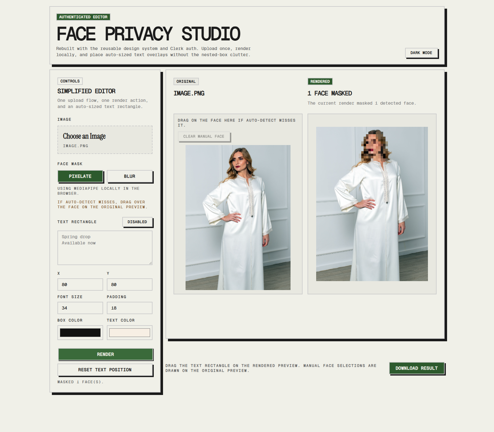
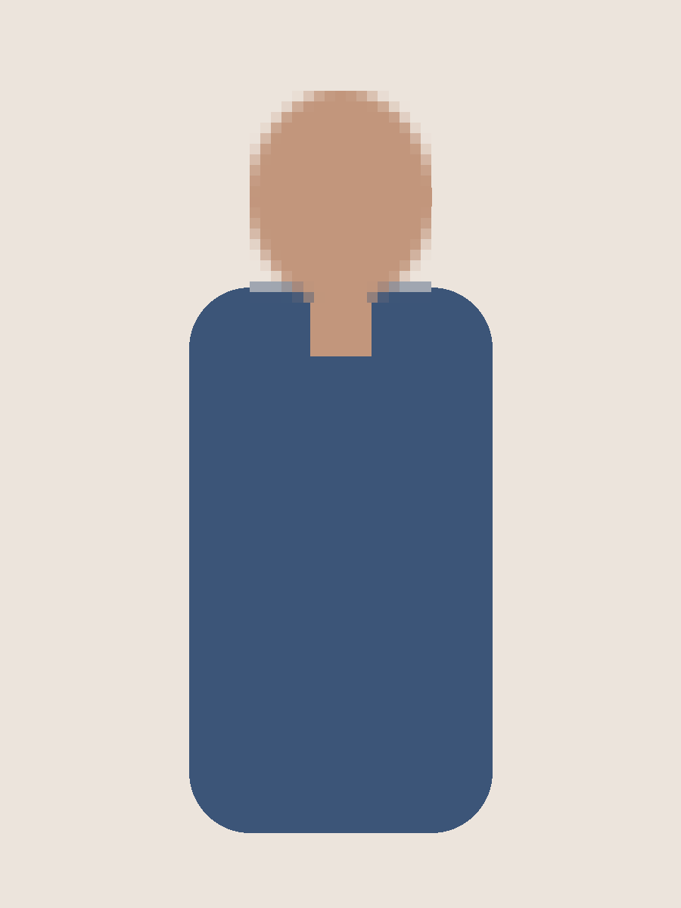

# Nadia

[](https://github.com/DancingPumpkin65/nadia-main/stargazers)
[](LICENSE.md)

Browser-based face privacy editor with reusable auth and design-system building blocks.

## Interface



## Before and After

<table>
  <tr>
	<td><strong>Original sample</strong></td>
	<td><strong>Processed sample</strong></td>
  </tr>
  <tr>
	<td></td>
	<td></td>
  </tr>
</table>

## What the app does

- Upload an image locally in the browser
- Detect faces and hide them with blur or pixelation
- Fall back to manual face selection when auto-detection misses
- Add an auto-sized text rectangle overlay
- Keep the Python prototype available separately in `apps/python`

## Repository layout

- `apps/web`: current Bun + Vite + React browser app
- `apps/python`: original Python face privacy pipeline
- `archive/static-web`: older static prototype kept aside
- `docs/samples`: source and output examples
- `docs/verification`: local verification artifacts

## Setup

### Requirements

- Bun 1.x
- Node.js 20+ if you want compatibility with non-Bun tooling
- A Clerk publishable key for the authenticated flow

### Install

```powershell
cd apps\web
bun install
```

### Environment

Create `apps/web/.env`:

```env
VITE_CLERK_PUBLISHABLE_KEY=pk_test_xxx
```

### Run locally

```powershell
cd apps\web
bun run dev
```

### Production build

```powershell
cd apps\web
bun run build
```

## How to use

1. Upload an image.
2. Choose `pixelate` or `blur`.
3. Press `Render`.
4. If the browser detector misses, place a manual face box on the original preview.
5. Optionally enable the text overlay and render again.

## Notes and constraints

- Face masking runs client-side in the browser.
- Detection quality depends on browser support and image difficulty.
- Manual fallback exists because hard faces are not always detected automatically.
- The masked region is intentionally degraded. The rest of the image is re-exported from canvas.
- Metadata from the original file is not preserved in the rendered export.

## Samples

- `docs/demo/sample_input.png`
- `docs/demo/sample_result.png`
- `docs/demo/interface.png`

## Development context

This repo was split so the browser product and the original Python tooling can evolve independently while staying in one workspace.
